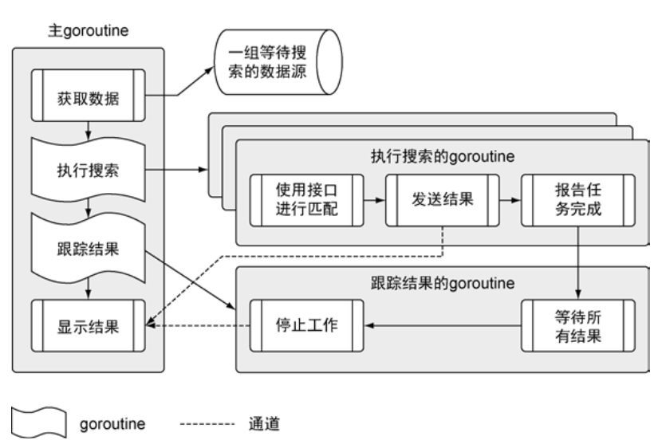

在不同的数据源中搜索数据，并且打印搜索结果
首先是在不同的goroutine中运行。

1. 从朱goroutine中开始
2. 一直到执行搜索的goroutine和跟踪结果的goroutine
3. 最后回到主goroutine

程序代码
* 文件夹data下的json文档，是程序要获取和处理的数据源
* 文件夹matchers中包含用于支持不同搜索数据源的代码（目前仅RSS）
* 文件夹search中包含使用不同匹配器进行搜索的业务逻辑
* 最后main.go是整个程序的入口
